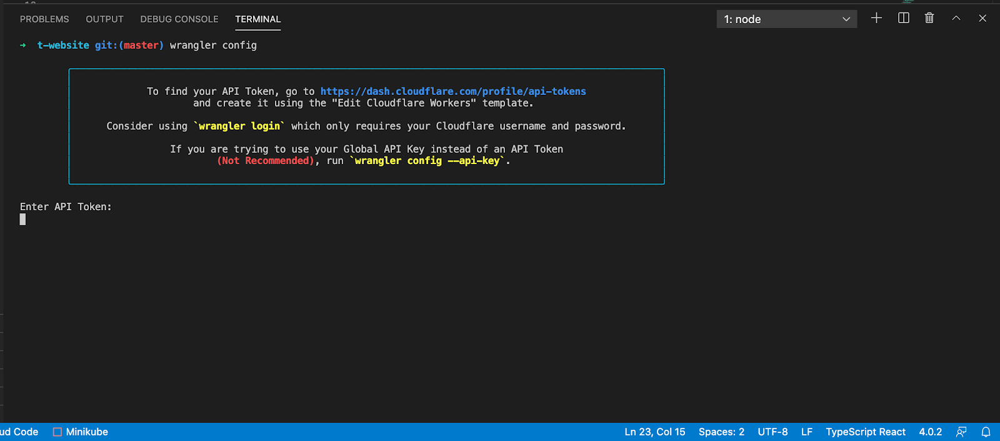
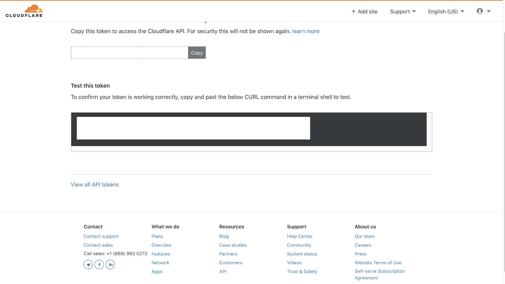
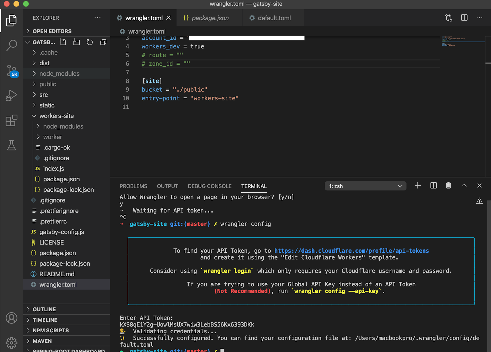
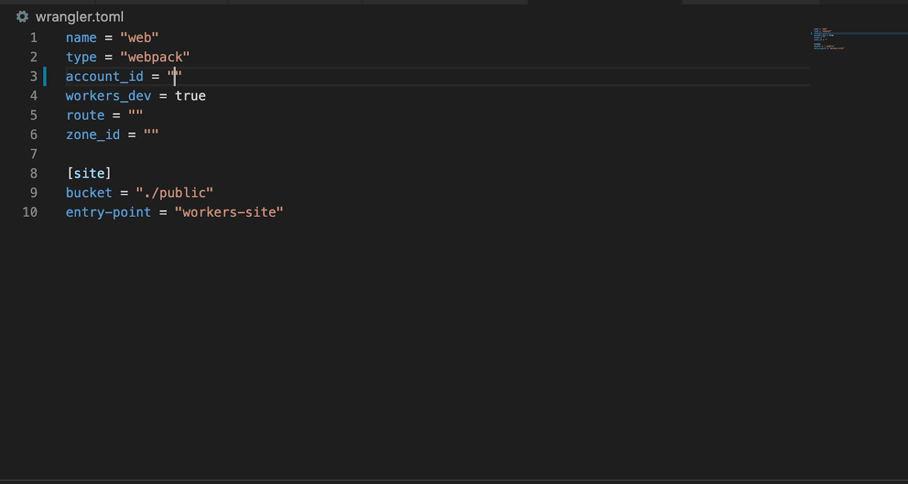
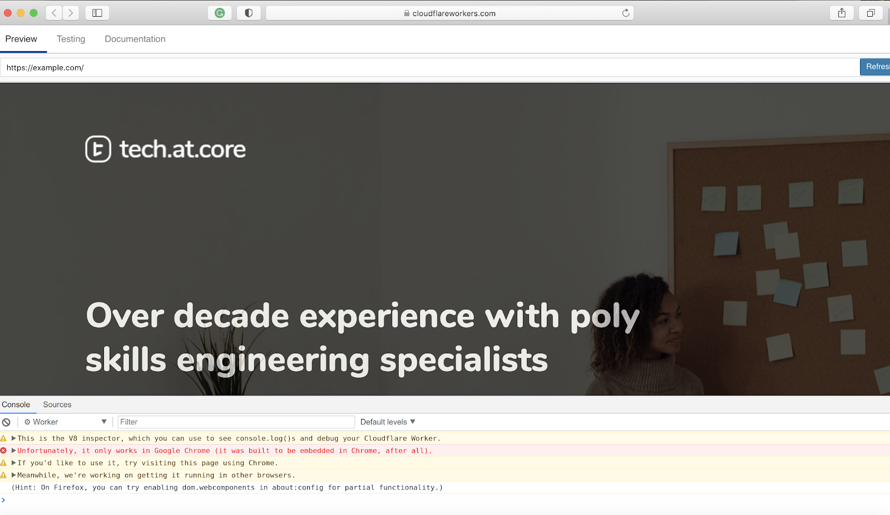
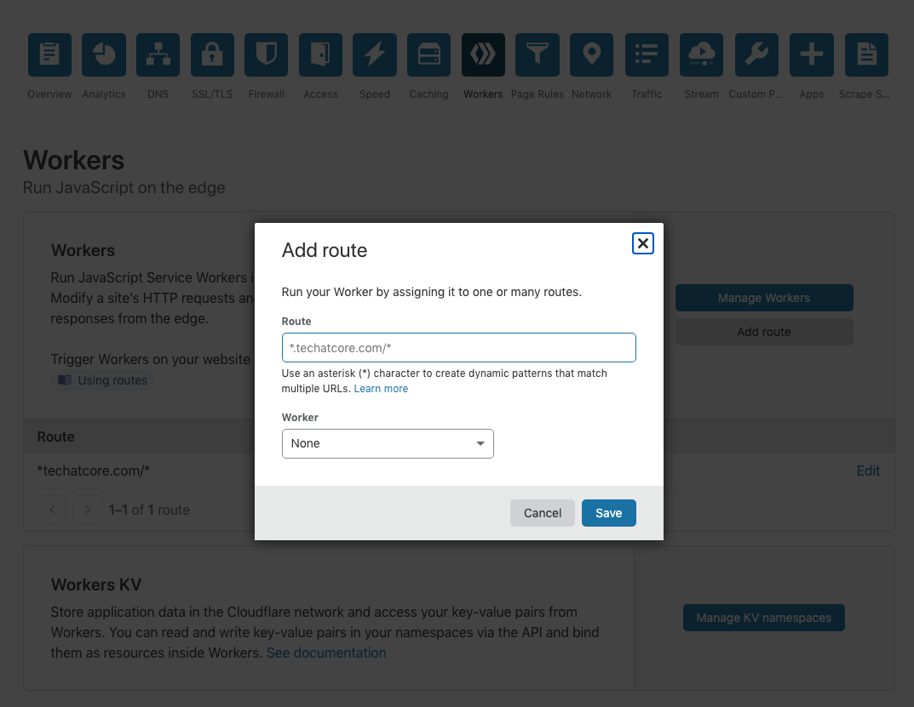
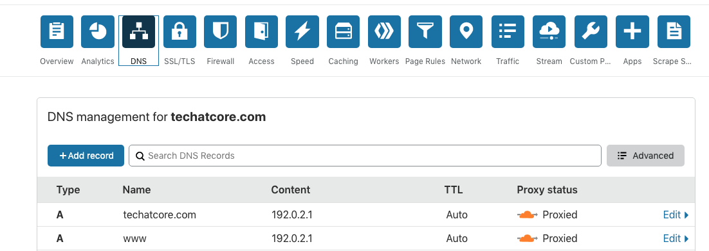
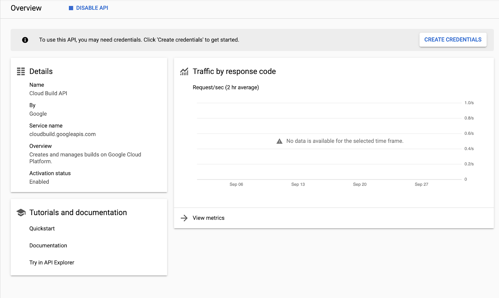
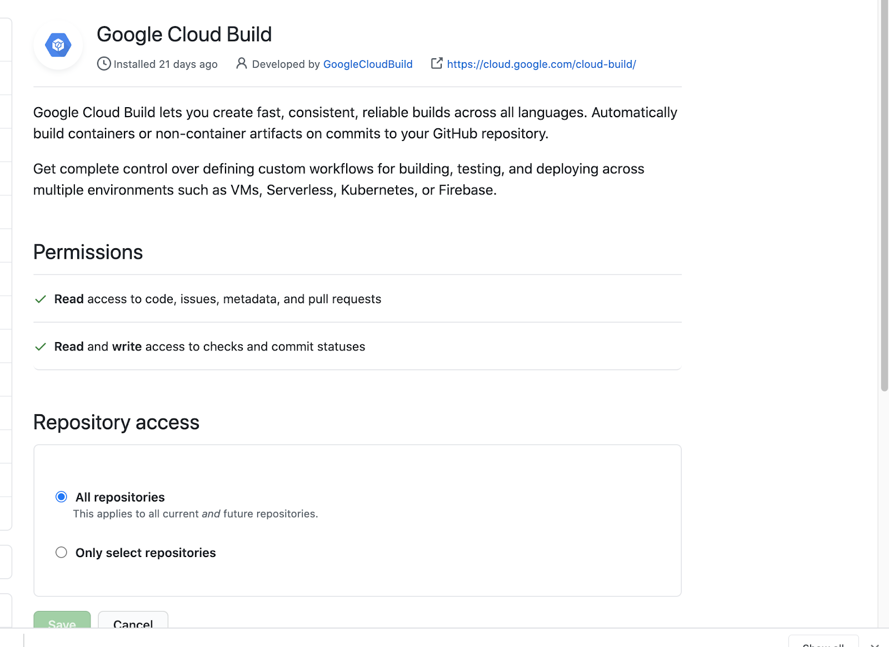
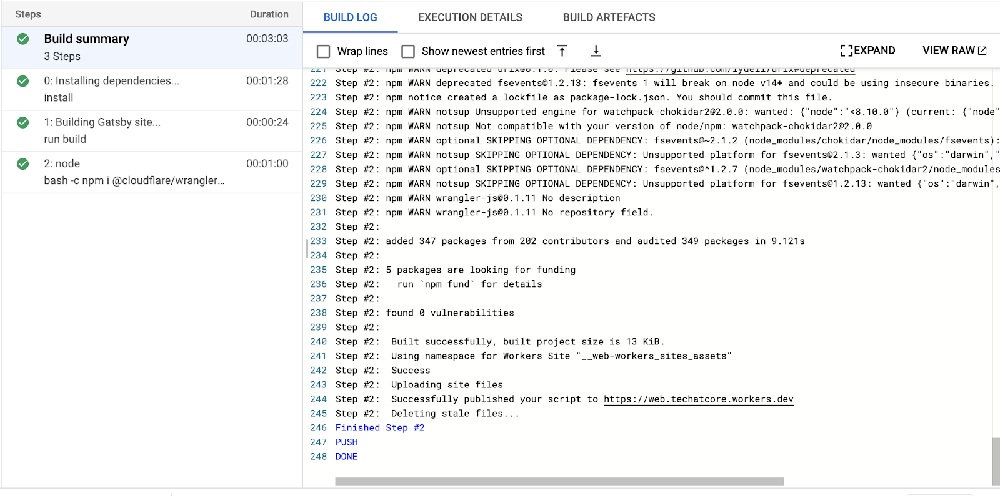

The London Eye Credit...John Harper/Spaces Images, via Corbis

# What are Cloudflare workers:

Cloudflare Workers is a serverless platform for creating entirely new applications or augmenting existing ones without configuring or maintaining infrastructure.            To enable the KV store required to serve the Gatsby files, you’ll need the Workers Unlimited plan for $5/month.

## What is gatsby site      

  **Gatsby** is a React-based open-source framework for creating websites and apps. Build anything you can imagine with over 2000 plugins and performance, scalability, and security built-in by default. 

 **Note**: I don’t think it’s fair to call Gatsby a static site generator, because it’s much more than that. If you haven’t heard of Gatsby before, definitely go check it out.
 

 ## What is wrangler       
 
 **Wrangler** is a CLI (Command Line Interface) tool designed for folks who are interested in using and managing Cloudflare Workers projects. 
     * Use wrangler to deploy your Gatsby application globally without leaving the command-line interface.

## What is Cloudbuild
   Cloud Build is a service that executes your builds on Google Cloud Platform infrastructure. Cloud Build can import source code from Google Cloud Storage, Cloud Source Repositories, GitHub, or Bitbucket, execute a build to your specifications, and produce artifacts such as Docker containers or Java archives.

## How to Deploy
* I will assume, you already have a domain in Cloudflare Workers!

* Now I will try to explain how to deploy Gatsby site into workers!

## Prerequisites

  * Create a Cloudflare account in https://dash.cloudflare.com/login.

  * Create workers bundled  free plan (https://dash.cloudflare.com/9e06c9ac72df642b4376fb90cd2dddc7/workers/plans) with some limitations like: -->Includes 100,000 requests per day
    -->Up to 10ms CPU time per request
    -->Lowest latency after the first request
    -->Up to 30 Workers.
  * Create Gatsby site here https://www.gatsbyjs.com/docs/quick-start/.

* Install wrangler by using npm (npm i -g @cloudflare/wrangler). * Create a Billing enabled project in Google Cloud Platform(GCP).
* Create a GitHub account if you don't have one already.
* Enable the Cloud Build API in the target Cloud project.

## Directions: 

* Build your Gatsby application using **gatsby build**

* Run **wrangler config** where you’ll be prompted for your Cloudflare API token.

* Run **wrangler init --site**

* Configure wrangler.toml. First, add **account ID** field and then either 
  1. A free workers.dev domain by setting workers_dev = true
  2. A custom domain on Cloudflare by setting workers_dev = false, zone_id = "abdc.. and route = customdomain.com/*

* In wrangler.toml set bucket = "./public”

* Run wrangler publish and your site will be deployed in seconds! 
* Create a billing enabled project in Google Cloud Platform(GCP).

## Part 1: Setting Up Gatsby 

* Open a terminal in vscode

* Install the Gatsby CLI                  
 
 `npm install -g gatsby-cli`

* Create a new site
    gatsby new gatsby-site gitrepolink (In my case  gatsby new gatsby-site https://github.com/BandariChetanKumar/cloudflare-gatsby.git)
* Open site directory in vscode 
```js
  git add .
  git commit -m “initial commit
  git remote add origin gitrepolink\
  git push -u origin master 
  ``` 
* Start the development server
   **-->gatsby develop**
  
  Now gatsby will start a hot-reloading development environment accessible by default at http://localhost:8000.
  Try editing the home page in src/pages/index.js. Saved changes will live to reload in the browser.
* Create a production build
   **-->gatsby  build**
     
* Gatsby will perform an optimized production build for your site, generating static HTML and per-route JavaScript code bundles.

* Serve the production build locally     
**-->gatsby serve**


Gatsby starts a local HTML server for testing your built site. Remember to build your site using gatsby build before using this command.

## Part 2: Setting Up Wrangler 

* run wrangler config 



* Collect API Token from your Domain API Token list in cloudflare workers account and paste it in command line. Follow the Quick Start for steps on gathering the correct account ID and API token to link wrangler to your Cloudflare account.



* Now, you will see below screen that you are successfully configured.



* If you don’t already have **workers.dev** domain run      

`wrangler subdomain`

* Run wrangler init --site. So here it will create   Wrangler.toml file and also required things will be added.  


* Wrangler.toml file looks like below 



* Next add Account id in wrangler .toml

* To  Previewing the Site **wrangler preview --watch**


* Run wrangler publish and your site will be deployed in seconds!. 


If you encountered below error after wrangler publish don’t panic 


### Solution: 

* Simply enable KV store  Workers Unlimited plan for $5/month and retry **wrangler publish**
* In my case, the website is successfully published at https://web.techatcore.workers.dev/ 
* Next add the **subdomain route** to the existing **domain in cloudflare workers** and change the **DNS management** based on requirements  like below:




## Part 3: Setting up Cloud Build

* If you have not already done so, enable the **Cloud Build API** in the target Cloud project.



* Go to the GitHub marketplace page for the Google Cloud Build app. https://github.com/marketplace/google-cloud-build
* Scroll down and click **Setup with Google Cloud Build** at the bottom of the page.
* If prompted, sign in to GitHub.
* In the **Edit your plan** page, select or update your billing information and click **grant this app access.**

* Select one of the following options based on your business need: 
    * **All repositories** - enable all current and future GitHub repositories for access via the Cloud Build app.
    * **Only select repositories** - use the **Select repositories** drop-down to only enable specific repositories for access via the Cloud Build app. You will be able to enable additional repositories at a later time.
* Click Install you will able to see below screen


* Sign in to Google Cloud. 
  The Authorization page is displayed where you are asked to authorize the Google Cloud Build app to connect to Google Cloud Platform.
  

* Click Authorize Google Cloud Build by GoogleCloudBuild. You are redirected to the Cloud Console.
* Select your Cloud project.
* Check the consent checkbox and click Next.
In the Select repository page that appears, connect your GitHub repositories to your Cloud project as follows:

  a. Confirm the correct GitHub account has been selected.
  b. Select the checkbox next to each target repository.
  c. Read the consent disclaimer and select the checkbox next  to    it to indicate that you accept the presented terms.
  d. Click **Connect repository.**


  If you don't see one or more of your target repositories, click **Edit repositories on GitHub** and repeat the steps above to enable additional repositories in the Cloud Build app.

* You now have successfully installed the Google Cloud Build app, connect your chosen repositories to your Cloud project, and created push triggers that will launch your build.


* Add cloudbuild.yaml file to your Gatsby project as below 

**Note**:Add substitutions variables directly in cloudbuild while adding repository

```js
steps:

# Install dependencies


 - name: node:10.16.0
   id: Installing dependencies...
   entrypoint: npm
   args: ["install"]
   waitFor: ["-"] # Begin immediately


# Gatsby build


 - name: node:10.16.0
   id: Building Gatsby site...
   entrypoint: npm
   args: ["run", "build"]   


# Wrangler


 - name: 'node'
   args: ['bash', '-c', 'npm i @cloudflare/wrangler && ./node_modules/.bin/wrangler publish']
   env:
    - 'CF_API_TOKEN=${_CF_API_TOKEN}'
    - 'CF_ACCOUNT_ID=${_CF_ACCOUNT_ID}'
    - 'USER=root'
```

* Next run Wrangler publish now automatically cloudbuild trigger fires and deploys gatsby site into Cloudflare Workers as below

